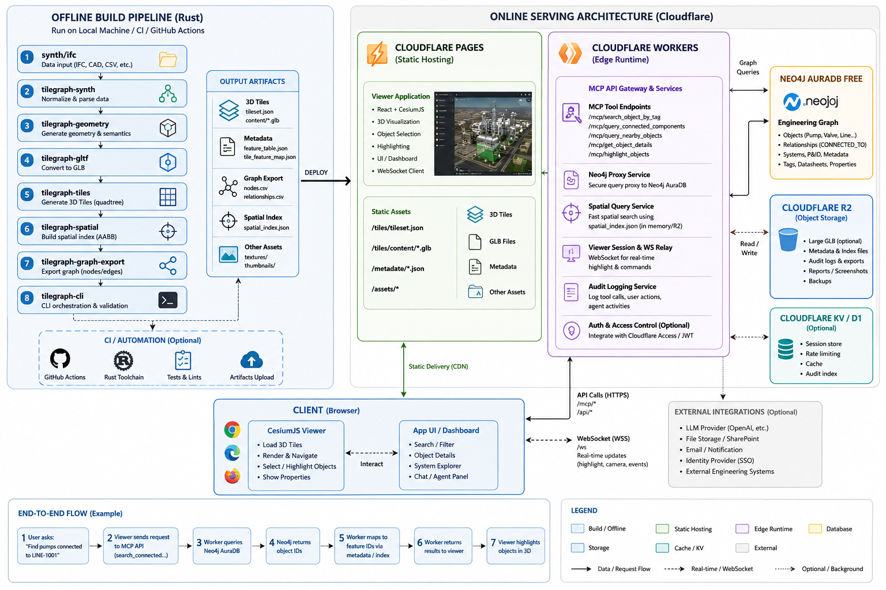

# TileGraphAgent

**TileGraphAgent turns industrial 3D from a visual asset into an agent-readable engineering system.**

Industrial CAD → 3D Tiles 1.1 → Knowledge Graph → MCP Agent Bridge



---




```mermaid
flowchart LR

%% =========================================================
%% OFFLINE BUILD PIPELINE
%% =========================================================

subgraph OFFLINE["OFFLINE BUILD PIPELINE (Rust)"]
direction TB

A["Synthetic Plant Spec<br/>IFC Sample<br/>JSON Metadata"]

B["tilegraph-synth<br/>Generate Industrial Objects"]

C["tilegraph-ingest<br/>Normalize Scene Graph"]

D["tilegraph-geometry<br/>Generate Meshes<br/>AABB<br/>Transforms"]

E["tilegraph-gltf<br/>Export GLB"]

F["tilegraph-tiles<br/>Generate 3D Tiles"]

G["tilegraph-spatial<br/>Build R-Tree Index"]

H["tilegraph-graph-export<br/>Export Neo4j Graph"]

I["tilegraph-cli<br/>Validation & Reports"]

A --> B
B --> C
C --> D
D --> E
E --> F
F --> G
G --> H
H --> I
end


%% =========================================================
%% OUTPUT ARTIFACTS
%% =========================================================

subgraph OUTPUT["BUILD OUTPUT ARTIFACTS"]
direction TB

T1["tileset.json"]
T2["GLB Content"]
T3["feature_table.json"]
T4["tile_feature_map.json"]
T5["spatial_index.json"]
T6["Neo4j CSV Export"]
T7["Validation Reports"]

end

F --> T1
F --> T2
F --> T3
F --> T4

G --> T5
H --> T6
I --> T7


%% =========================================================
%% CLOUDFLARE PAGES
%% =========================================================

subgraph PAGES["CLOUDFLARE PAGES"]
direction TB

P1["React + CesiumJS Viewer"]

P2["Static 3D Tiles<br/>tileset.json"]

P3["GLB Content"]

P4["Metadata Files"]

P1 --> P2
P1 --> P3
P1 --> P4

end

T1 --> P2
T2 --> P3
T3 --> P4
T4 --> P4


%% =========================================================
%% CLOUDFLARE WORKERS
%% =========================================================

subgraph WORKERS["CLOUDFLARE WORKERS"]
direction TB

W1["MCP API Gateway"]

W2["Neo4j Query Service"]

W3["Spatial Query Service"]

W4["Viewer Command Service"]

W5["Audit Logging"]

W6["WebSocket Relay"]

W1 --> W2
W1 --> W3
W1 --> W4
W1 --> W5
W4 --> W6

end

T5 --> W3


%% =========================================================
%% DATABASES
%% =========================================================

subgraph NEO4J["NEO4J AURADB FREE"]
direction TB

N1["Engineering Objects"]

N2["Connectivity Graph"]

N3["Systems"]

N4["P&ID"]

N5["Datasheets"]

end

T6 --> NEO4J


subgraph STORAGE["OPTIONAL CLOUDFLARE STORAGE"]
direction TB

R1["R2 Object Storage"]

R2["KV Cache"]

R3["D1 Audit Database"]

end

W3 --> R1
W5 --> R3
W1 --> R2


%% =========================================================
%% CLIENT
%% =========================================================

subgraph CLIENT["BROWSER CLIENT"]
direction TB

C1["CesiumJS Viewer"]

C2["Model Tree"]

C3["Properties Panel"]

C4["Agent Chat Panel"]

C5["Audit Trail"]

C6["Search & Filter"]

end

P1 --> C1

C1 --> C2
C1 --> C3
C1 --> C4
C1 --> C5
C1 --> C6


%% =========================================================
%% ONLINE REQUEST FLOW
%% =========================================================

CLIENT -->|"HTTPS"| W1

W2 -->|"Cypher Queries"| NEO4J
NEO4J -->|"Results"| W2

W6 -->|"WebSocket Events"| CLIENT

PAGES -->|"CDN Delivery"| CLIENT


%% =========================================================
%% VIEWER COMMAND FLOW
%% =========================================================

W4 -->|"highlight_objects"| CLIENT
W4 -->|"isolate_system"| CLIENT
W4 -->|"focus_camera"| CLIENT
W4 -->|"show_bounding_boxes"| CLIENT


%% =========================================================
%% AGENT FLOW
%% =========================================================

subgraph AGENT["LLM AGENT WORKFLOW"]
direction TB

A1["User Question"]

A2["search_object_by_tag"]

A3["query_connected_components"]

A4["query_upstream_downstream"]

A5["get_tile_feature_mapping"]

A6["highlight_objects_in_viewer"]

A7["generate_maintenance_context"]

A8["Evidence-Based Response"]

A1 --> A2
A2 --> A3
A3 --> A4
A4 --> A5
A5 --> A6
A6 --> A7
A7 --> A8

end

CLIENT --> A1
A2 --> W1
A3 --> W1
A4 --> W1
A5 --> W1
A6 --> W1
A7 --> W1
```

## Architecture

```
Synthetic Plant Spec (plant_spec.json)
    ↓ [tilegraph-synth]
Normalized Industrial Scene Graph
    ↓ [tilegraph-ingest / tilegraph-geometry]
Mesh + Metadata Split → Tessellated Mesh Groups
    ↓ [tilegraph-gltf]
GLB Content Files (area-a-piping.glb, area-a-equipment.glb, ...)
    ↓ [tilegraph-tiles]
3D Tiles 1.1 Tileset (tileset.json + metadata/)
    ↓
Spatial Index (R-tree / spatial_index.json)
    ↓ [tilegraph-graph-export]
Neo4j Knowledge Graph (EngObject nodes + relationships)
    ↓ [tilegraphmcp]
MCP Server (12 tools + resources + audit log)
    ↓
LLM Agent → CesiumJS Viewer (WebSocket bridge)
```

---

## Quick Start

```bash
# 1. Start Neo4j
docker-compose up -d neo4j

# 2. Generate synthetic plant data
cargo run --bin tilegraph -- generate-synth

# 3. Build 3D Tiles + GLB content
cargo run --bin tilegraph -- build-tiles

# 4. Export Knowledge Graph
cargo run --bin tilegraph -- build-graph

# 5. Import to Neo4j
cat output/graph/schema.cypher output/graph/import.cypher | \
  docker exec -i tilegraph-agent-neo4j-1 cypher-shell -u neo4j -p password

# 6. Start MCP server
cd apps/tilegraphmcp && npm install && npm run dev

# 7. Start viewer
cd apps/tilegraphviewer && npm install && npm run dev

# 8. Validate pipeline
cargo run --bin tilegraph -- validate
```

---

## Rust Workspace Crates

| Crate                    | Purpose                                                |
| ------------------------ | ------------------------------------------------------ |
| `tilegraph-core`         | Domain model, ObjectId, AABB, transforms, error types  |
| `tilegraph-synth`        | Synthetic industrial plant generator                   |
| `tilegraph-ingest`       | Source adapters (synth + IFC stub)                     |
| `tilegraph-geometry`     | Mesh tessellation, material library, geometry batching |
| `tilegraph-gltf`         | GLB export with EXT_mesh_features feature IDs          |
| `tilegraph-tiles`        | 3D Tiles 1.1 tileset.json generation                   |
| `tilegraph-spatial`      | R-tree spatial index (rstar crate)                     |
| `tilegraph-graph-export` | Neo4j Cypher + CSV export                              |
| `tilegraph-cli`          | CLI entry point                                        |

---

## MCP Tools (12)

`search_object_by_tag` · `get_object_properties` · `query_connected_components` · `query_upstream_downstream` · `query_objects_in_area` · `query_nearby_objects` · `get_tile_feature_mapping` · `highlight_objects_in_viewer` · `isolate_system_in_viewer` · `focus_camera_on_objects` · `create_issue_from_selection` · `generate_maintenance_context`

---

## Demo Question

> "Find all pumps connected to LINE-1001, show their isolation valves, isolate the affected system in the viewer, and explain the maintenance impact."

See `docs/architecture/demo_scenario.md` for the full tool chain, sample queries, and expected output.

---

## Limitations (V1)

- Synthetic data only — no real RVM, NWD, or IFC files
- IFC adapter is a stub (`tilegraph-ingest/src/ifc_stub.rs`)
- Single-level tile hierarchy (no LOD)
- Draco compression not yet implemented

_Portfolio project by Thanh Hoang-Minh — 2026_
