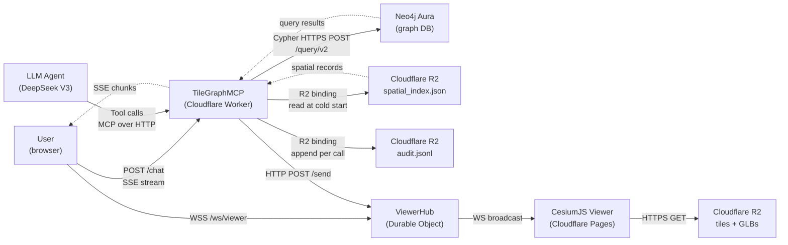
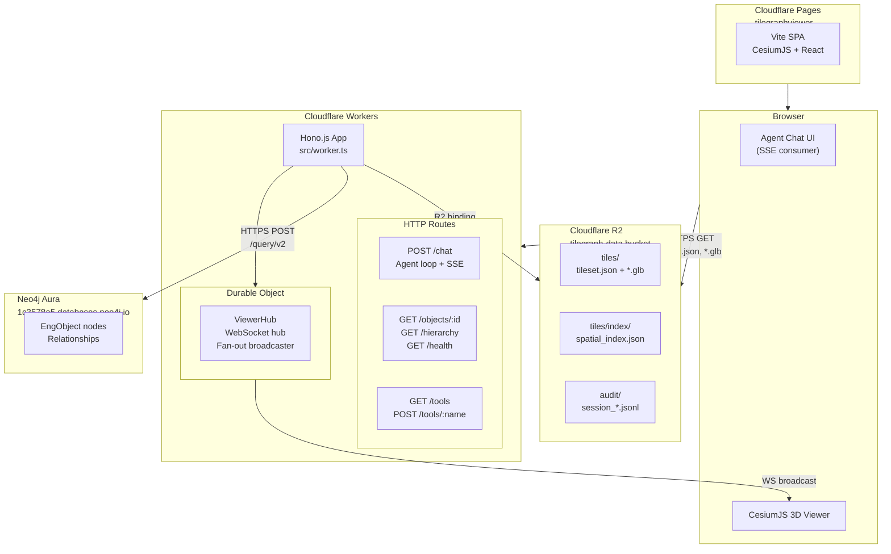
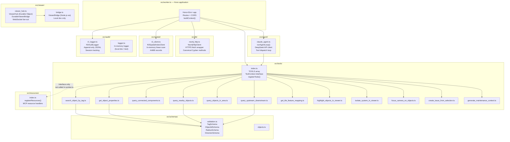
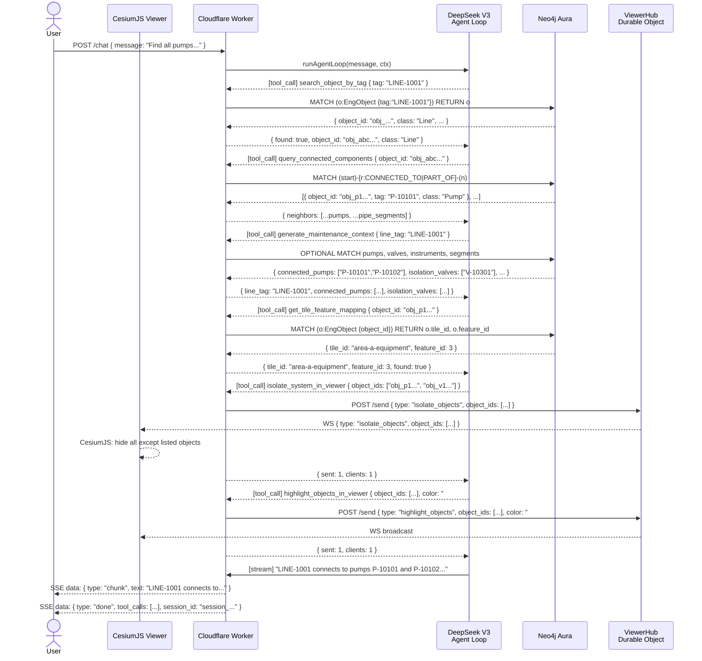
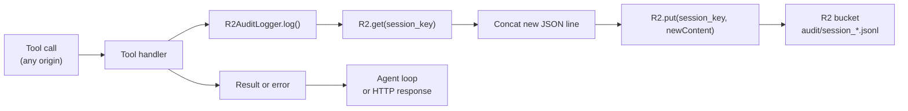
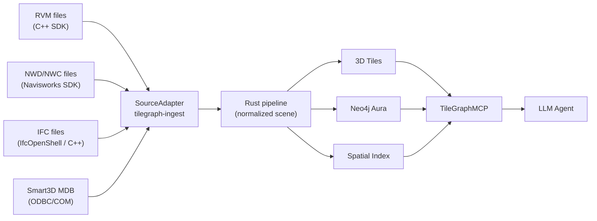
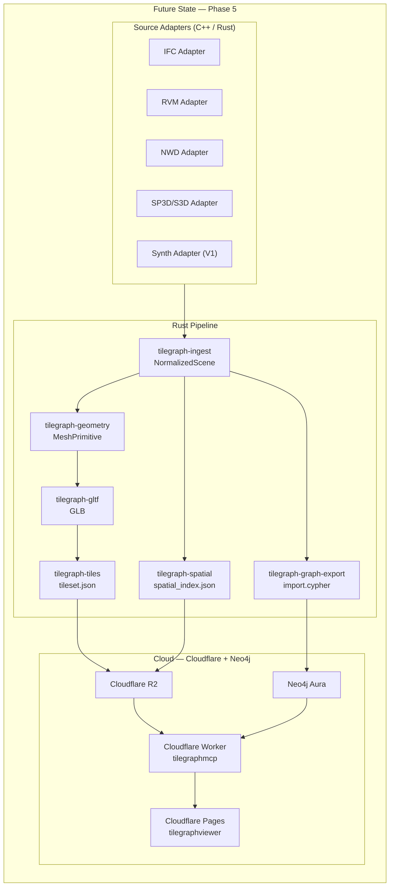

# TileGraphMCP — MCP Layer Architecture

> Primary architecture reference for `apps/tilegraphmcp`. Read this before touching any file in this directory.

---

## 1. Overview

TileGraphMCP is the AI-agent bridge layer of the TileGraphAgent platform. It sits between an LLM agent and three upstream data systems — Neo4j Aura (engineering knowledge graph), Cloudflare R2 (spatial index + 3D tiles), and the CesiumJS viewer — and exposes a deterministic, schema-validated, auditable tool surface over the Model Context Protocol (MCP).

**Why it exists.** An LLM cannot reason safely over triangles or raw graph dumps. It needs bounded, named, schema-enforced operations that return structured evidence. TileGraphMCP defines those operations. Every fact the agent presents to the user is traceable to a specific tool call and a specific database record.

**Where it sits.** TileGraphMCP is deployed as a Cloudflare Worker. It is the only component in the online runtime that the agent talks to. It is not a general-purpose proxy — it is an opinionated façade that encodes the engineering reasoning rules the agent must follow.

**What it bridges.**

| Upstream system | Role                     | Protocol used                  |
| --------------- | ------------------------ | ------------------------------ |
| Neo4j Aura      | Engineering object graph | HTTPS (Neo4j Query API v2)     |
| Cloudflare R2   | Spatial index, audit log | R2 binding (in-process fetch)  |
| CesiumJS viewer | 3D visualization         | WebSocket (Durable Object hub) |
| LLM agent       | Tool consumer            | MCP over HTTP-SSE or REST      |

---

## 2. Responsibilities

### What TileGraphMCP SHOULD do

- Expose deterministic, Zod-validated MCP tools that the agent can call without side effects on engineering data.
- Resolve engineering tags (e.g. `P-10101`) to stable `object_id` values before any downstream query.
- Query the Neo4j graph for connectivity, flow direction, and object properties.
- Query the in-memory spatial index for radius-based proximity searches.
- Map graph `object_id` values to `tile_id` / `feature_id` pairs needed by the viewer.
- Issue viewer commands (highlight, isolate, focus) to all connected CesiumJS tabs via the Durable Object WebSocket hub.
- Append a structured audit entry to R2 for every tool call, whether successful or not.
- Surface structured error codes (`NOT_FOUND`, `GRAPH_UNAVAILABLE`, `VALIDATION_ERROR`) so the agent can reason about failures rather than crashing.

### What TileGraphMCP MUST NOT do

- Render 3D geometry or produce GLB content — that is the Rust pipeline's job.
- Process or parse CAD/BIM source files — those are ingested offline.
- Generate or modify 3D Tiles tilesets — produced by `tilegraph-tiles` during pipeline runs.
- Write to or mutate Neo4j nodes or relationships — the graph is read-only from the MCP layer; writes happen via `build-graph --push-to-neo4j` during pipeline runs.
- Bypass schema validation and pass unvalidated input directly to Cypher queries — all parameters go through Zod before reaching `Neo4jHttpClient`.
- Silently swallow tool errors — every failure must produce a structured error response and an audit entry.

---

## 3. Position Inside the Platform



**Request flow:** User submits a natural-language query via `POST /chat`. The Worker spawns an agent loop using the DeepSeek V3 API. The agent issues tool calls back to the Worker, which dispatches to Neo4j or the in-memory spatial index. The agent streams text chunks back to the user via SSE.

**Command flow:** When the agent calls `highlight_objects_in_viewer`, the Worker sends an HTTP POST to the `ViewerHub` Durable Object (`/send`). The Durable Object fans the JSON command out to all connected WebSocket clients. The CesiumJS viewer receives the command and updates object colors in the 3D scene.

**Response flow:** Tool results flow from Neo4j → `Neo4jHttpClient` → tool handler → agent message history → agent final response → SSE stream → browser.

---

## 4. Online Runtime Architecture



### Cloudflare Workers (tilegraphmcp)

The Worker is the central runtime hub. It uses Hono.js for routing, not the `@modelcontextprotocol/sdk` SSE transport directly. The MCP protocol is currently surfaced as REST (`GET /tools`, `POST /tools/:name`) rather than the canonical `GET /sse` + `POST /messages` transport pair described in the architecture docs. See Section 10 for the gap assessment.

**Routes:**

| Method | Path           | Purpose                                      |
| ------ | -------------- | -------------------------------------------- |
| `GET`  | `/health`      | Neo4j latency probe + spatial record count   |
| `GET`  | `/objects/:id` | Object properties from Neo4j by `object_id`  |
| `GET`  | `/hierarchy`   | Area → System → Line tree from Neo4j         |
| `GET`  | `/tools`       | List all MCP tool definitions                |
| `POST` | `/tools/:name` | Execute a single tool by name                |
| `POST` | `/chat`        | Streaming SSE agent loop (DeepSeek)          |
| `GET`  | `/ws/viewer`   | WebSocket upgrade → ViewerHub Durable Object |

**Cloudflare constraints that shape the design:**

- No TCP socket support → cannot use Neo4j Bolt driver; uses HTTPS + `fetch()` to Neo4j Query API v2.
- No persistent in-process state across requests → spatial index loaded from R2 on each request (or isolate warm-start).
- Durable Objects provide the only persistent WebSocket fan-out primitive.

### Neo4j Aura

Graph storage for all engineering objects and their relationships. Accessed exclusively via HTTPS POST to `/db/neo4j/query/v2`. The Worker authenticates with HTTP Basic Auth. All Cypher is parameterized — never string-interpolated — before being sent over the wire.

**Graph model summary:**

- Every node carries `:EngObject` + one class label (`:Pump`, `:Valve`, `:Line`, `:Area`, `:System`, etc.)
- Every node has `object_id` (deterministic SHA-256, format `obj_<32hex>`), `tag`, `class`, `status`, `tile_id`, `feature_id`, `aabb_min_x/y/z`, `aabb_max_x/y/z`.
- Relationships: `PART_OF`, `CONNECTED_TO`, `UPSTREAM_OF`, `ISOLATED_BY`, `LOCATED_IN`.

### Cloudflare R2 (tilegraph-data)

Static object store. Contains three categories of objects the Worker reads at runtime:

| Key prefix                       | Purpose                           | Reader                          |
| -------------------------------- | --------------------------------- | ------------------------------- |
| `tiles/index/spatial_index.json` | R-tree records (exported by Rust) | `R2SpatialIndexClient`          |
| `audit/session_*.jsonl`          | Append-only tool audit log        | `R2AuditLogger`                 |
| `tiles/` + `tiles/content/`      | 3D Tiles manifest + GLBs          | CesiumJS (direct browser fetch) |

### Cloudflare Pages (tilegraphviewer)

Static Vite + CesiumJS SPA served from CDN edge. Connects to:

- R2 public URL for `tileset.json` and `*.glb` (direct HTTPS, no Worker involved).
- Worker `/hierarchy` and `/objects/:id` for model tree and properties panel.
- Worker `/chat` for agent query UI.
- Durable Object WebSocket (`/ws/viewer`) for real-time viewer commands.

---

## 5. Internal Components



### Component Details

#### `src/worker.ts` — Application Entry Point

**Purpose:** Hono.js application that wires all components together and defines HTTP routes.

**Responsibilities:**

- Build a `ToolContext` per-request via `buildContext(env)`.
- Route `POST /chat` to `runAgentLoop()`.
- Route `POST /tools/:name` to the appropriate tool handler.
- Expose REST endpoints for the viewer's UI panels.

**Dependencies:** All other modules. `buildContext` constructs `Neo4jHttpClient`, `R2SpatialIndexClient`, `R2AuditLogger`, and the viewer bridge.

**Current state:** Uses `NoopViewerBridge` — viewer commands are silently discarded. `DurableViewerBridge` (from `viewer_hub.ts`) is implemented but not wired.

**Public interface:** Cloudflare Worker `default` export (`app`).

---

#### `src/agent/claude_agent.ts` — Agent Loop

**Purpose:** Drives a multi-turn LLM conversation with tool-use capability.

**Responsibilities:**

- Translate TOOLS definitions into OpenAI-compatible function schemas.
- Call the DeepSeek V3 API (OpenAI-compatible endpoint) with tool schemas.
- Dispatch tool calls to the registered `TOOLS` array handlers.
- Accumulate tool results into the message history and iterate until `finish_reason === "stop"`.
- Stream text chunks to the caller via `onChunk` callback.
- Audit-log every tool call inside the loop.

**Key function:** `runAgentLoop(userMessage, ctx, onChunk, systemPrompt, apiKey, model, maxToolRounds=8)`

**Dependencies:** `TOOLS` array, `ToolContext`, DeepSeek API.

**Note:** Despite the filename referencing Claude, the agent uses `DEEPSEEK_API_KEY` and the DeepSeek V3 model (`deepseek-chat`). The `ANTHROPIC_API_KEY` referenced in architecture docs is not used in the current implementation.

---

#### `src/tools/index.ts` — Tool Registry

**Purpose:** Central registry of all 12 MCP tools. Defines the `ToolContext` contract and the `TOOLS` array.

**Responsibilities:**

- Export `ToolContext` interface — the dependency injection surface every tool handler receives.
- Export duck-typed interfaces: `INeo4jClient`, `ISpatialIndexClient`, `IViewerBridge`, `IAuditLogger`.
- Export `TOOLS` array used by both the agent loop and the REST `/tools` routes.
- Export `registerTools(server, ctx)` for future MCP SSE wiring.

**Key interfaces:**

```typescript
interface ToolContext {
  neo4j: INeo4jClient
  spatialIndex: ISpatialIndexClient
  viewerBridge: IViewerBridge
  auditLogger: IAuditLogger
}
```

---

#### `src/db/neo4j_http.ts` — Neo4j Client

**Purpose:** HTTPS wrapper around Neo4j's Query API v2. The only place Cypher is issued.

**Responsibilities:**

- Translate `neo4j+s://` URIs to `https://` for `fetch()` compatibility in the Workers runtime.
- POST `{ statement, parameters }` to `/db/{database}/query/v2`.
- Unwrap Neo4j v2 response format (node elements with `elementId`, `labels`, `properties`).
- Expose canonical query methods that encode the graph model.
- Enforce a per-request timeout via `AbortController`.

**Canonical query methods:**

| Method                           | Cypher pattern                                      | Used by                        |
| -------------------------------- | --------------------------------------------------- | ------------------------------ |
| `findObjectByTag(tag)`           | `MATCH (o:EngObject {tag}) RETURN o`                | `search_object_by_tag`         |
| `getObjectProperties(id)`        | `MATCH (o:EngObject {object_id}) RETURN o`          | `get_object_properties`        |
| `queryConnectedComponents(id)`   | `MATCH (start)-[r:CONNECTED_TO\|PART_OF]-(n)`       | `query_connected_components`   |
| `queryUpstream(id, hops)`        | `MATCH path = (start)-[:UPSTREAM_OF*1..N]->(up)`    | `query_upstream_downstream`    |
| `queryDownstream(id, hops)`      | `MATCH path = (start)<-[:UPSTREAM_OF*1..N]-(down)`  | `query_upstream_downstream`    |
| `pumpsConnectedToLine(tag)`      | `MATCH (p:Pump)-[:CONNECTED_TO]->(l:Line)`          | `generate_maintenance_context` |
| `isolationValvesForLine(tag)`    | `MATCH (v:Valve)-[:ISOLATED_BY\|PART_OF]->(l:Line)` | `generate_maintenance_context` |
| `maintenanceContextForLine(tag)` | Multi-OPTIONAL MATCH aggregate                      | `generate_maintenance_context` |
| `objectsInArea(tag)`             | `MATCH (a:Area)<-[:PART_OF\|LOCATED_IN*1..4]-(o)`   | `query_objects_in_area`        |
| `healthCheck()`                  | `RETURN 1 AS ok`                                    | `/health` route                |

**Dependencies:** `fetch()` global (Workers runtime).

---

#### `src/spatial/r2_client.ts` — Spatial Index Client

**Purpose:** In-memory spatial query engine backed by `spatial_index.json` loaded from R2.

**Responsibilities:**

- Fetch `tiles/index/spatial_index.json` from R2 at cold start via `load()`.
- Hold all `SpatialRecord` objects in a flat array.
- Perform radius-based proximity searches via linear scan (no R-tree in the Worker).
- Find records by `object_id` or `tag` for viewer mapping.

**Key limitation:** `queryNearby` iterates all records with `O(n)` distance computation. For the current synthetic dataset (~300 objects) this is acceptable. For production datasets (100k+ objects) this will become the bottleneck. See Section 11, Phase 2.

**SpatialRecord schema:**

```typescript
interface SpatialRecord {
  object_id: string // obj_<32hex>
  tag: string | null // e.g. "P-10101"
  class: string // "Pump", "Valve", etc.
  aabb_min: [number, number, number] // meters, Y-up
  aabb_max: [number, number, number]
  tile_id: string | null // e.g. "area-a-equipment"
  feature_id: number | null // GLB EXT_mesh_features ID
}
```

---

#### `src/audit/r2_logger.ts` — Audit Logger

**Purpose:** Append-only audit trail written per-session to R2 as NDJSON.

**Responsibilities:**

- Generate a unique `session_id` per `R2AuditLogger` instance (one per Worker request).
- Append structured `AuditEntry` records to `audit/session_<id>.jsonl` in R2.
- Track call count and total duration for session summary.

**R2 append pattern:** R2 does not support append operations. The logger reads the existing file, concatenates the new line, and writes the entire file back. This is correct for low-frequency tool calls but is not suitable for high-throughput audit streams.

**Known stub:** `getSessionEntries()` and `getLastEntries()` return empty arrays — R2 reads are async and not feasible in the synchronous read path expected by these methods.

---

#### `src/viewer/viewer_hub.ts` — Viewer WebSocket Hub

**Purpose:** Cloudflare Durable Object that holds WebSocket connections to all open viewer tabs and fans out `ViewerCommand` messages.

**Components:**

- `ViewerHub` (Durable Object): Accepts WebSocket upgrades at `/ws`. Accepts command POSTs at `/send`. Returns status at `/status`.
- `DurableViewerBridge`: Client stub used by tool handlers. Resolves the single shared `ViewerHub` instance by name `"viewer-hub"` and POSTs commands to `/send`.

**ViewerCommand union type:**

```typescript
type ViewerCommand =
  | { type: "highlight_objects"; object_ids: string[]; color?: string }
  | { type: "isolate_objects"; object_ids: string[] }
  | { type: "focus_camera"; object_ids: string[] }
  | { type: "show_bounding_boxes"; object_ids: string[] }
  | { type: "clear_highlights" }
  | { type: "create_issue_marker"; object_id: string; title: string; severity: string }
  | { type: "ping" }
  | { type: "pong" }
```

**Current state:** `ViewerHub` and `DurableViewerBridge` are fully implemented but the Worker uses `NoopViewerBridge` — viewer commands are not routed through the Durable Object.

#### `src/viewer/bridge.ts` — Local Dev ViewerBridge

**Purpose:** Node.js `ws`-based WebSocket server for local development only. Not used in the deployed Worker.

**Not imported by** `worker.ts`. Used only in local standalone MCP server scenarios.

---

#### `src/resources/index.ts` — MCP Resources

**Purpose:** Defines MCP resources that expose static context to the agent (model summary, selection state, audit log).

**Implemented resources:**

| URI                              | Content                                                     |
| -------------------------------- | ----------------------------------------------------------- |
| `tilegraph://model/summary`      | Spatial index record count, viewer connectivity, session ID |
| `tilegraph://selection/current`  | Current viewer selection (always empty — stub)              |
| `tilegraph://audit/session/{id}` | Session summary + entries (entries always empty — stub)     |
| `tilegraph://audit/last/{n}`     | Last N audit entries (always empty — stub)                  |

**Current state:** `registerResources()` is implemented but not called in `worker.ts`. Resources are not exposed to the agent in the deployed version.

---

#### `src/schemas/validation.ts` — Input Validation Schemas

**Purpose:** Zod schemas shared across tool handlers for input sanitization at the Worker boundary.

| Schema                | Pattern                                | Used by                     |
| --------------------- | -------------------------------------- | --------------------------- |
| `TagSchema`           | `/^[A-Z0-9\-_\.]+$/i`, max 64 chars    | `search_object_by_tag`      |
| `ObjectIdSchema`      | `/^obj_[a-f0-9]{32}$/`                 | All graph/viewer tools      |
| `ObjectIdArraySchema` | 1–50 `ObjectIdSchema` elements         | Viewer command tools        |
| `RadiusSchema`        | `number`, positive, max 500m           | `query_nearby_objects`      |
| `DirectionSchema`     | `"upstream" \| "downstream" \| "both"` | `query_upstream_downstream` |

---

## 6. MCP Tools

| Tool                           | Purpose                                                          | Input                                                                    | Output                                                                         | Dependencies       | Status                         |
| ------------------------------ | ---------------------------------------------------------------- | ------------------------------------------------------------------------ | ------------------------------------------------------------------------------ | ------------------ | ------------------------------ |
| `search_object_by_tag`         | Resolve engineering tag → `object_id`. **Must be called first.** | `tag: string`                                                            | `{ found, object_id, class, status, tile_id, feature_id, aabb_min, aabb_max }` | Neo4j              | Implemented                    |
| `get_object_properties`        | Full property set for a known object                             | `object_id: string`                                                      | `{ object_id, properties: {...} }`                                             | Neo4j              | Implemented                    |
| `query_connected_components`   | Immediate neighbors via `CONNECTED_TO` / `PART_OF`               | `object_id: string`                                                      | `{ neighbors: [{ object_id, tag, class, rel_type }] }`                         | Neo4j              | Implemented                    |
| `query_upstream_downstream`    | Flow-direction traversal up to N hops                            | `object_id, direction: "upstream"\|"downstream"\|"both", max_hops: 1–10` | `{ upstream_objects, downstream_objects, upstream_count, downstream_count }`   | Neo4j              | Implemented                    |
| `query_objects_in_area`        | All objects parented to an Area node                             | `area_tag: string`                                                       | `{ objects: [{ object_id, tag, class, tile_id, feature_id }] }`                | Neo4j              | Implemented                    |
| `query_nearby_objects`         | Radius search around a 3D point                                  | `center: [x,y,z], radius_m: number, class_filter?: string`               | `{ nearby: [{ ...record, distance_m }] }`                                      | Spatial index (R2) | Implemented (linear scan)      |
| `get_tile_feature_mapping`     | Confirm tile + feature_id for geometry                           | `object_id: string`                                                      | `{ tile_id, feature_id, found }`                                               | Neo4j              | Implemented                    |
| `highlight_objects_in_viewer`  | Send highlight command to viewer                                 | `object_ids: string[], color?: string`                                   | `{ sent, clients }`                                                            | ViewerBridge       | Implemented (Noop in deployed) |
| `isolate_system_in_viewer`     | Send isolate command to viewer                                   | `object_ids: string[]`                                                   | `{ sent, clients }`                                                            | ViewerBridge       | Implemented (Noop in deployed) |
| `focus_camera_on_objects`      | Focus CesiumJS camera on objects                                 | `object_ids: string[]`                                                   | `{ sent, clients }`                                                            | ViewerBridge       | Implemented (Noop in deployed) |
| `generate_maintenance_context` | Aggregate maintenance data for a line                            | `line_tag: string`                                                       | `{ line_tag, connected_pumps, isolation_valves, instruments, segment_count }`  | Neo4j              | Implemented                    |
| `create_issue_from_selection`  | Log an engineering issue marker                                  | `object_id, title, severity`                                             | `{ issue_id, logged }`                                                         | R2 (audit)         | Implemented                    |

**Planned tools (not yet implemented):**

| Tool                     | Purpose                                            | Status  |
| ------------------------ | -------------------------------------------------- | ------- |
| `query_objects_by_class` | List all objects of a given class (e.g. all Pumps) | Planned |
| `get_pid_document`       | Retrieve P&ID mock document linked to a line       | Planned |
| `get_datasheet`          | Retrieve datasheet JSON linked to an object        | Planned |
| `list_work_packages`     | List maintenance work packages affecting an object | Planned |
| `compare_revisions`      | Compare object state across pipeline runs          | Planned |

---

## 7. Request Lifecycle

Example query: **"Find all pumps connected to LINE-1001, show their isolation valves, isolate the affected system in the viewer, and explain the maintenance impact."**



**Audit entries written during this lifecycle (by R2AuditLogger):**

```jsonl
{"session_id":"session_1748909000_x3k2","timestamp":"2026-06-02T10:00:01Z","tool_name":"search_object_by_tag","input":{"tag":"LINE-1001"},"output_summary":"{\"found\":true,\"object_id\":\"obj_abc...\"","duration_ms":87}
{"session_id":"session_1748909000_x3k2","timestamp":"2026-06-02T10:00:01Z","tool_name":"query_connected_components","input":{"object_id":"obj_abc..."},"output_summary":"{\"neighbors\":[{\"object_id\":\"obj_p1","duration_ms":103}
{"session_id":"session_1748909000_x3k2","timestamp":"2026-06-02T10:00:02Z","tool_name":"generate_maintenance_context","input":{"line_tag":"LINE-1001"},"output_summary":"{\"line_tag\":\"LINE-1001\",\"connected_pumps\":","duration_ms":95}
```

---

## 8. Data Contracts

### Object Identity

Every object that crosses a crate or service boundary is identified by a stable `object_id`. The full identity record for a resolved object:

| Field        | Format                           | Authority                                                                    | Example                    |
| ------------ | -------------------------------- | ---------------------------------------------------------------------------- | -------------------------- |
| `object_id`  | `obj_<32 lowercase hex>`         | `tilegraph-core` (SHA-256 of `"synth:" + source_tag`, first 16 bytes as hex) | `obj_3f7a8c2d1e9b4f6a...`  |
| `tag`        | Alphanumeric + `-_./`, ≤64 chars | Source adapter (synth or IFC)                                                | `P-10101`                  |
| `tile_id`    | `{area}-{class}` string          | `tilegraph-tiles` at `build-tiles` time                                      | `area-a-equipment`         |
| `feature_id` | Unsigned integer ≥ 0             | `tilegraph-gltf` (`_FEATURE_ID_0` vertex attribute)                          | `3`                        |
| `source_id`  | Free-form string                 | Source adapter                                                               | `synth:PUMP-AREA-A-SYS1-1` |

The `object_id` is deterministic: re-running the pipeline with the same source data produces the same IDs. This is the invariant that lets the graph, spatial index, and GLB files stay consistent across pipeline runs without a coordination protocol.

### Viewer Mapping

To drive viewer actions, the agent must resolve graph objects to feature IDs:

```
object_id → (tile_id, feature_id) → CesiumJS feature selection
```

This mapping is stored in two places:

1. **Neo4j** — on every `EngObject` node as `tile_id` and `feature_id` properties.
2. **Spatial index** — in `SpatialRecord.tile_id` and `SpatialRecord.feature_id`.

Reverse mapping (feature → object) is handled client-side in CesiumJS via the `EXT_mesh_features` extension and the `tile_feature_map.json` file (read from R2).

### Graph Mapping

```
tag → (search_object_by_tag) → object_id → Neo4j EngObject node → properties + relationships
```

The `object_id` is the canonical join key between:

- The Neo4j node (`MATCH (o:EngObject {object_id: $id})`)
- The spatial index record (`findByObjectId(id)`)
- The GLB node extras (`extras.object_id`)
- The viewer selection event

No tool should accept or return a bare `tag` as a graph traversal key. Tags are resolved to `object_id` exactly once via `search_object_by_tag` and `object_id` is used for all subsequent operations.

---

## 9. Audit Architecture

Every tool call — whether issued via the agent loop, the REST `/tools/:name` endpoint, or the MCP `CallTool` handler — produces an `AuditEntry` written to R2.

**Why audit logs exist:**

- Engineering decisions must be traceable. If an agent concludes a system can be isolated, a reviewer must be able to verify which graph queries supported that conclusion.
- The audit log is the authoritative record of agent behavior per session.
- It enables post-hoc debugging of incorrect agent answers.

**What is logged per entry:**

```typescript
interface AuditEntry {
  session_id: string // Unique per Worker request lifecycle
  timestamp: string // ISO 8601
  tool_name: string // e.g. "search_object_by_tag"
  input: unknown // Full deserialized args
  output_summary: string // First 200 chars of JSON-serialized result
  duration_ms: number // Wall time from handler invocation to return
  error?: string // Error code if tool failed, absent on success
}
```

**Session tracking:** A new `R2AuditLogger` is constructed per HTTP request in `buildContext()`. Each instance generates a unique `session_id` at construction time. All tool calls within one agent loop share the same `session_id`.

**Storage:** `audit/session_<session_id>.jsonl` in the `tilegraph-data` R2 bucket. One file per session, NDJSON format. Not publicly accessible (only via R2 binding or Wrangler).



**Viewer action tracking:** Viewer commands (`highlight_objects_in_viewer`, `isolate_system_in_viewer`, `focus_camera_on_objects`) are also audit-logged because they cross the boundary between agent decision and physical system state (the 3D visualization). An audit entry is written even when the `ViewerBridge` is a Noop.

---

## 10. Current State Assessment

### Implemented

| Component                   | Status                    | Notes                                                                      |
| --------------------------- | ------------------------- | -------------------------------------------------------------------------- |
| All 12 MCP tool handlers    | Complete                  | All tools in `src/tools/`, registered in `TOOLS` array                     |
| `Neo4jHttpClient`           | Complete                  | Uses Query API v2, fully parameterized, timeout-guarded                    |
| `R2SpatialIndexClient`      | Complete                  | Loads from R2, linear scan, AABB center-point distance                     |
| `R2AuditLogger`             | Complete (write path)     | Read path stubs return empty arrays                                        |
| `ViewerHub` Durable Object  | Complete                  | `DurableViewerBridge` implemented; not wired in Worker                     |
| `ViewerBridge` (Node.js)    | Complete                  | Local dev only; not used in deployed Worker                                |
| Input validation schemas    | Complete                  | `TagSchema`, `ObjectIdSchema`, `RadiusSchema`, `DirectionSchema`           |
| Agent loop (`runAgentLoop`) | Complete                  | DeepSeek V3, max 8 tool rounds, streaming SSE                              |
| REST endpoints              | Complete                  | `/health`, `/objects/:id`, `/hierarchy`, `/tools`, `/tools/:name`, `/chat` |
| MCP `registerTools()`       | Implemented but not wired | Function exists; not called in `worker.ts`                                 |
| MCP `registerResources()`   | Implemented but not wired | Function exists; not called in `worker.ts`                                 |

### Partially Implemented

| Feature                 | Gap                                                                                                                                                                      |
| ----------------------- | ------------------------------------------------------------------------------------------------------------------------------------------------------------------------ |
| MCP SSE transport       | `registerTools()` / `registerResources()` exist but `GET /sse` + `POST /messages` routes are not in `worker.ts`. Tools are exposed as REST, not canonical MCP transport. |
| Viewer command pipeline | `DurableViewerBridge` is complete but `worker.ts` uses `NoopViewerBridge`. Viewer commands from tools are silently dropped.                                              |
| Audit read path         | `R2AuditLogger.getSessionEntries()` and `getLastEntries()` return `[]`. The `tilegraph://audit/*` resources surface no data.                                             |
| MCP resources           | `registerResources()` handlers are correct but not reachable via the deployed Worker.                                                                                    |
| Model summary resource  | `tilegraph://model/summary` returns only spatial record count — no Neo4j object counts are included.                                                                     |

### Missing

| Feature                                   | Description                                                                                                                                 |
| ----------------------------------------- | ------------------------------------------------------------------------------------------------------------------------------------------- |
| `tilegraph://object/{tag}` resource       | Per-object detail resource from MasterPrompt spec. Not implemented.                                                                         |
| `tilegraph://system/{system_id}` resource | System detail resource. Not implemented.                                                                                                    |
| `tilegraph://line/{line_id}` resource     | Line detail resource. Not implemented.                                                                                                      |
| `tilegraph://pid/{pid_id}` resource       | P&ID document resource. Not implemented.                                                                                                    |
| `wrangler.toml` Durable Object binding    | `[[durable_objects]]` section required to wire `ViewerHub`. Without it, `/ws/viewer` route cannot upgrade to a DO.                          |
| Spatial R-tree in Worker                  | `R2SpatialIndexClient` uses `O(n)` linear scan. No Worker-side R-tree.                                                                      |
| Multi-model LLM support                   | Agent is hard-coded to DeepSeek V3; no Anthropic Claude path in the agent loop despite `ANTHROPIC_API_KEY` referenced in architecture docs. |
| Retry / backoff on Neo4j                  | `Neo4jHttpClient` throws immediately on failure; no retry policy for transient Aura unavailability.                                         |
| Connection pooling / caching for Neo4j    | New HTTPS connection per query; no keep-alive or pooled client.                                                                             |
| Rate limiting on `/chat`                  | No request rate limiting; a single client can saturate the DeepSeek API budget.                                                             |

### Risks

| Risk                                             | Severity            | Impact                                                                                                                                 |
| ------------------------------------------------ | ------------------- | -------------------------------------------------------------------------------------------------------------------------------------- |
| `NoopViewerBridge` in production                 | High                | All viewer commands (highlight, isolate, focus) are silently dropped. The flagship demo feature does not work in the deployed version. |
| Missing `[[durable_objects]]` in `wrangler.toml` | High                | `/ws/viewer` WebSocket route cannot function without the DO binding.                                                                   |
| MCP SSE not wired                                | Medium              | Claude Desktop and other standard MCP clients cannot connect. Tools only accessible via REST or the `/chat` agent loop.                |
| R2 audit append is non-atomic                    | Medium              | Concurrent tool calls within one isolate can produce corrupted JSONL if two `log()` calls interleave their read-concat-write cycles.   |
| Linear spatial scan                              | Low (current scale) | Acceptable for ≤1000 objects. Will become a bottleneck at production dataset sizes.                                                    |
| Audit read stubs                                 | Low                 | `tilegraph://audit/session/*` resources return no data; session replay for debugging is not available.                                 |

### Recommended Next Steps

**Priority 1 (blocking the demo):**

1. Add `[[durable_objects]]` binding in `wrangler.toml` for `ViewerHub`.
2. Replace `NoopViewerBridge` in `worker.ts` with `DurableViewerBridge`.
3. Verify `/ws/viewer` WebSocket upgrade and viewer highlight command end-to-end.

**Priority 2 (MCP correctness):** 4. Add `GET /sse` and `POST /messages` routes to `worker.ts` using `SSEServerTransport` and call `registerTools()` + `registerResources()`. 5. Fix audit read path — either load session entries from R2 or replace with an in-memory accumulator that the resource handler can read synchronously.

**Priority 3 (robustness):** 6. Add `ANTHROPIC_API_KEY` path to `claude_agent.ts` so the agent can use Claude as an alternative to DeepSeek. 7. Add exponential backoff retry in `Neo4jHttpClient` for `GRAPH_UNAVAILABLE` errors. 8. Add per-session rate limiting on `/chat`.

**Priority 4 (feature completeness):** 9. Implement `tilegraph://object/{tag}`, `tilegraph://system/{id}`, `tilegraph://line/{id}` resources. 10. Add `query_objects_by_class` tool.

---

## 11. Future Architecture

### Phase 1 — Graph Query MCP (current)

The current state: tools expose Neo4j graph traversal over HTTPS. Spatial queries are linear-scan. Viewer commands are no-ops in deployed version.

**Milestone:** Graph query tools working in production against Neo4j Aura. Agent can answer engineering graph questions.

### Phase 2 — Spatial Query MCP

Replace linear scan in `R2SpatialIndexClient` with a proper spatial index structure serialized from Rust. Options:

- Embed a WebAssembly build of the Rust `rstar` index for O(log n) nearest-neighbor queries.
- Pre-sort records by a space-filling curve (Z-order / Morton code) and use binary search for radius queries.
- Build a simple in-memory grid index (bucket by cell, query neighboring cells) — sufficient for plant-scale datasets.

**Milestone:** `query_nearby_objects` returns results in < 5ms for 10,000-object spatial indexes.

### Phase 3 — Viewer Command MCP

Wire `DurableViewerBridge` into the deployed Worker. Implement the complete viewer command pipeline:

- `ViewerHub` Durable Object bound in `wrangler.toml`.
- `DurableViewerBridge` used in production `buildContext()`.
- CesiumJS viewer connects to `wss://.../ws/viewer` and handles all `ViewerCommand` types.
- Viewer sends `ObjectSelected` events back through the DO to the Worker (bidirectional).

**Milestone:** Agent can highlight objects in the viewer. Live demo works end-to-end.

### Phase 4 — Agent Workflow MCP

Add MCP SSE transport (`GET /sse` + `POST /messages`) so standard MCP clients (Claude Desktop, VS Code extensions) can connect without using the `/chat` REST endpoint. Wire `registerTools()` and `registerResources()` into the SSE handler. Implement remaining MCP resources.

Add multi-agent workflow support: one session can spawn sub-agents for spatial vs. graph reasoning, with results merged before the final agent response.

**Milestone:** Claude Desktop can connect to the deployed Worker and run full engineering queries without the viewer UI.

### Phase 5 — Production Multi-Model Support

Extend the Rust pipeline with real source adapters:



- **IFC**: `IfcOpenShell` (C++) or `ifc-rs` (Rust) for geometry extraction. `IfcAdapter` stub in `tilegraph-ingest` upgraded to full implementation.
- **RVM**: Proprietary Read-Write 3D (AVEVA) — C++ SDK required; interfaces to `tilegraph-ingest` via FFI.
- **NWD/NWC**: Autodesk Navisworks SDK (C++); geometry and property extraction via `GeometryOverrideCallback`.
- **Smart3D / SP3D**: ODBC connection to MDB-backed engineering databases; property-only ingestion (no geometry from this source).

For each new adapter: the `object_id` SHA-256 derivation rule changes (`adapter_name:source_id` prefix), but the downstream pipeline — graph export, spatial index, MCP tools — is unchanged.

**Milestone:** Same MCP tools work against a real IFC building model as against the synthetic plant. The agent cannot tell the difference — the graph model is identical.


